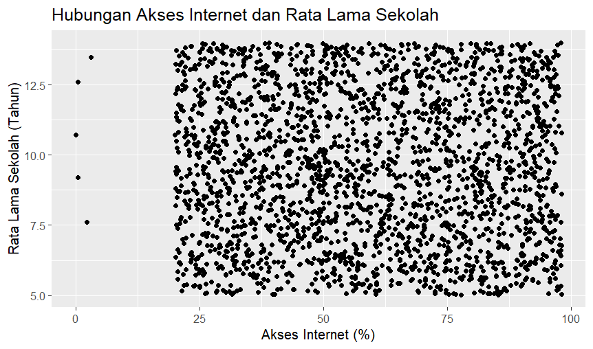
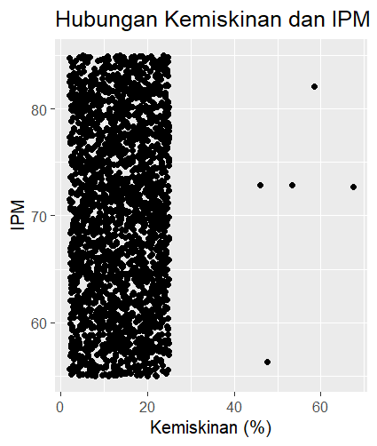

```{r setup, include=FALSE}
knitr::opts_chunk$set(echo = TRUE)

```

\begin{center}

{\Large \textbf{ANALISIS DATA PEMBANGUNAN WILAYAH}}

{\Large \textbf{MENGGUNAKAN R}}

\vspace{0.5cm}

\textbf{Disusun Oleh:}

\vspace{0.5cm}

\begin{tabular}{p{8cm}p{3cm}}
Muhamad Akbar Zainuri & J0403251008\
Zalfa Nazla Azkiya & J0403251037\
Diaz Ramaananta Harahap & J0403251048\
Dede Risma Komalasari & J0403251049\
Nashira Salima Firmansyah & J0403251056\
Fahrizal Azis & J0403251151\
\end{tabular}

\vspace{0.5cm}

\includegraphics[width=3.5cm]{../gambar/Logo_IPB.png}

\vspace{0.5cm}

\large{\textbf{MATA KULIAH PROBABILITAS & STATISTIKA}}

\large{\textbf{PROGRAM STUDI TEKNOLOGI REKAYASA PERANGKAT LUNAK}}

\large{\textbf{SEKOLAH VOKASI}}

\large{\textbf{INSTITUT PERTANIAN BOGOR}}

\large{\textbf{BOGOR}}

\large{\textbf{2026}}

\end{center}

\thispagestyle{empty}
\newpage

\begin{center}
{
\bfseries

```
\vfill

\Large

DAFTAR ISI

```

}

\end{center}

\begin{flushleft}
BAB I \dotfill 1\
\hspace*{0.5cm}1.1 Latar Belakang \dotfill 1\
\hspace*{0.5cm}1.2 Tujuan \dotfill 1\[0.3cm]

BAB II \dotfill 2\
\hspace*{0.5cm}2.1 Dataset \dotfill 2\
\hspace*{0.5cm}2.2 Tools Yang Digunakan \dotfill 2\
\hspace*{0.5cm}2.3 Metode Analisis \dotfill 2\[0.3cm]

BAB III \dotfill 3\
\hspace*{0.5cm}3.1 Statistika Deskriptif \dotfill 3\
\hspace*{0.5cm}3.2 Missing Value \dotfill 3\
\hspace*{0.5cm}3.3 Outlier \dotfill 3\
\hspace*{0.5cm}3.4 Visualisasi \dotfill 3\
\hspace*{0.5cm}3.5 Distribusi Data \dotfill 3\
\hspace*{0.5cm}3.6 Korelasi \dotfill 3\
\hspace*{0.5cm}3.7 Interpretasi \dotfill 3\[0.3cm]

BAB IV \dotfill 4\
\hspace*{0.5cm}4.1 Kesimpulan Utama \dotfill 4\
\hspace*{0.5cm}4.2 Insight \dotfill 4\
\hspace*{0.5cm}4.3 Saran \dotfill 4\[0.3cm]

LAMPIRAN \dotfill 5\
\hspace*{0.5cm}5.1 Script R \dotfill 5\
\hspace*{0.5cm}5.2 Output Tambahan \dotfill 5\
\end{flushleft}

\thispagestyle{empty}

\newpage

\begin{center}
{
\bfseries

```
\vfill

\Large

BAB I

PENDAHULUAN

```

}
\end{center}

## \normalsize 1.1  \hspace {0,5cm} Latar Belakang

\vspace{-0.5cm}
Pembangunan wilayah adalah sebuah proses yang bertujuan untuk meningkatkan kesejahteraan masyarakat. Untuk mengetahui bagaimana suatu pembangunan wilayah di suatu daerah berhasil diperlukan indikator yang dapat menggambarkan keadaan masyarakat di wilayah tersebut dengan jelas, seperti angka kemiskinan, pengangguran, Produk Domestik Regional Bruto (PDRB), serta indeks pembangunan Manusia (IPM).

Oleh karena itu, diperlukan analisis data untuk mengolah informasi yang ada agar dapat memberikan gambaran tentang kondisi pembangunan di suatu wilayah. Berdasarkan kebutuhan tersebut, projek ini bertujuan untuk menganalisis data pembangunan wilayah di seluruh Indonesia dengan mengimplementasikan bahasa pemrograman R. Melalui projek akhir ini, mahasiswa diharapkan dapat meningkatkan keterampilan mereka dalam mengolah, menganalisis, dan menginterpretasikan data terkait pembangunan daerah dengan memanfaatkan bahasa pemrograman R.

## \normalsize 1.2  \hspace {0,5cm} Tujuan

\vspace{-0.5cm}
Proyek ini bertujuan untuk menganalisis data mengenai pembangunan wilayah di Indonesia dengan memanfaatkan bahasa pemrograman R. Analisis dilakukan untuk mengenali ciri-ciri data, memahami hubungan di antara indikator pembangunan, serta mengungkap faktor-faktor yang memengaruhi tingkat perkembangan suatu daerah. Di samping itu, proyek ini bertujuan untuk mengaplikasikan konsep statistika dan analisis data dalam menyelesaikan masalah yang ada serta menyajikan hasil analisis dengan cara yang terstruktur dan informatif.

\setcounter{page}{1}
\newpage

\begin{center}
{
\bfseries

```
\vfill

\Large

BAB II

METODOLOGI

```

}
\end{center}

## \normalsize 2.1  \hspace {0,5cm} Dataset

\vspace{-0.5cm}
Dataset adalah kumpulan data terstruktur yang digunakan untuk berbagai keperluan, seperti analisis, penelitian, atau pengolahan informasi lainnya. Di dalam sebuah dataset, terdapat sejumlah variabel yang disusun dalam bentuk tabel. Setiap kolom mewakili atribut tertentu, sementara setiap baris menggambarkan entitas atau observasi yang berbeda. Dataset menjadi komponen penting dalam pengolahan data, membantu menghasilkan informasi yang lebih bermakna dan bermanfaat.

Data yang digunakan dalam analisis ini adalah dataset skor pembangunan wilayah tingkat Kabupaten/Kota di Indonesia. Secara keseluruhan, dataset ini mencakup observasi 2.500 baris kabupaten/kota dengan 13 kolom variabel, yang berada dalam rentang waktu lima tahun, yaitu dari tahun 2020 hingga 2024. Berikut adalah rincian variabel-variabel yang telah dikelompokkan menjadi beberapa kategori:

1. Variabel Identitas Data      : wilayah, provinsi, dan tahun.
2. Variabel Ekonomi             : pdrb_perkapita, kemiskinan, dan pengangguran.
3. Variabel Pembangunan Manusia : ipm, harapan_hidup, rata_lama_sekolah.
4. Variabel Infrastruktur       : akses_internet, jalan_baik, air_bersih.
5. Variabel Metadata            : catatan_data.

Dataset pembangunan wilayah tersebut berbentuk dokumen .csv. Dokumen ini bisa diunduh melalui https://pembangunanwilayahmissingoutlier.tiiny.site untuk melihat dataset secara keseluruhan.

## \normalsize 2.2  \hspace {0,5cm} Tools Yang Digunakan

\vspace{-0.5cm}
Dalam melakukan analisis data ini, digunakan perangkat lunak Rstudio dan library ggplot2 untuk menghasilkan informasi yang terstruktur dan akurat tentang pembangunan wilayah di Indonesia. Berikut adalah rincian tools yang digunakan:

1. **Dataset format .csv:** Digunakan sebagai format penyimpanan data mentah yang menjadi objek utama analisis.
2. **Bahasa Pemrograman R:** R digunakan sebagai bahasa pemrograman utama untuk komputasi statistik dan analisis data. Bahasa ini dipilih karena memiliki kemampuan yang kuat dalam melakukan manipulasi data, serta menyediakan berbagai paket statistik yang mumpuni untuk melakukan analisis deskriptif maupun inferensial pada dataset.
3. **RStudio:** RStudio digunakan sebagai *Integrated Development Environment* (IDE) atau lingkungan pengembangan terintegrasi untuk menulis dan mengeksekusi kode R. RStudio mempermudah manajemen proyek, pemantauan variabel, penanganan error melalui antarmuka yang interaktif, serta mendukung penyusunan laporan menggunakan R Markdown.
4. **Library ggplot2:** Library ggplot2 digunakan untuk memenuhi kebutuhan visualisasi data. Library ini memungkinkan pembuatan grafik secara modular. Di dalam proyek ini, ggplot2 digunakan untuk menyajikan tren indikator pembangunan, mengidentifikasi sebaran data, serta memberikan visualisasi perbandingan kondisi antarwilayah secara informatif.

## \normalsize 2.3  \hspace {0,5cm} Metode Analisis

\vspace{-0.5cm}
Analisis data dilakukan menggunakan bahasa pemrograman R untuk memperoleh gambaran mengenai kondisi pembangunan wilayah di Indonesia. Tahapan analisis yang dilakukan adalah sebagai berikut:

1. **Pengumpulan Data:** Data yang digunakan merupakan data indikator pembangunan wilayah yang mencakup beberapa variabel pdrb_perkapita, kemiskinan, pengangguran, IPM, akses_internet, dll).
2. **Analisis Statistik Deskriptif:** Analisis statistik deskriptif dilakukan untuk menggambarkan karakteristik data melalui nilai minimum, nilai maksimum, rata-rata, median, standar deviasi, dan lain-lain.
3. **Analisis Missing Value:** Missing value dianalisis dengan menghitung jumlah dan persentase data yang hilang pada seiap variabel. Hasil analisis digunakan untuk menentukan metode penanganan yang sesuai.
4. **Analisis Outlier:** Deteksi outlier dilakukan menggunakan metode Interquartile Range (IQR). Suatu data dikatakan sebagai outlier apabila berada di luar batas.
5. **Visualisasi Data:** Visualisasi dilakukan untuk mempermudah interpretasi data menggunakan histogram, boxplot, scatter plot, dan heatmap korelasi.
6. **Analisis Korelasi:** Analisis korelasi digunakan untuk mengetahui hubungan antar indikator pembangunan wilayah. Kolerasi dihitung menggunakan koefisien korelasi pearson dengan rentang nilai −1 ≤ r ≤ 1. Nilai korelasi yang mendekati 1 menunjukkan hubungan positif yang kuat, sedangkan nilai yang mendekati -1 menunjukkan hubungan negatif yang kuat.

\setcounter{page}{2}
\newpage

\begin{center}
{
\bfseries

```
\vfill

\Large

BAB III

HASIL DAN PEMBAHASAN

```

}
\end{center}

## \normalsize 3.1  \hspace {0,5cm} Statistika Deskriptif

\vspace{-0.5cm}
Statistika deskriptif merupakan metode statistik yang digunakan untuk meringkas dan menggambarkan karakteristik utama dari suatu kumpulan data secara numerik. Analisis ini bertujuan untuk memberikan gambaran awal mengenai kondisi data pembangunan wilayah, khususnya terkait ukuran pemusatan data seperti mean dan median serta ukuran penyebaran data seperti standar deviasi, varians, dan rentang nilai.

Pada penelitian ini, analisis statistika deskriptif dilakukan terhadap seluruh variabel numerik pada dataset pembangunan wilayah menggunakan beberapa fungsi dalam bahasa pemrograman R seperti \textit{summary()}, \textit{mean()}, \textit{median()}, \textit{sd()}, \textit{var()}, dan \textit{quantile()}.

\vspace{-0.5cm}

\begin{center}
\textbf{Tabel 3.1 Hasil Statistika Deskriptif}

\begin{tabular}{|l|c|c|c|}
\hline
\textbf{Variabel} & \textbf{Mean} & \textbf{SD} & \textbf{Keterangan} \
\hline
pdrb_perkapita & Tinggi & Paling besar & Penyebaran sangat tinggi \
\hline
kemiskinan & 13,72 & Cukup besar & Terdapat variasi data \
\hline
pengangguran & 8 & Besar & Indikasi data ekstrem \
\hline
ipm & 69--70 & Relatif kecil & Distribusi stabil \
\hline
harapan_hidup & 69 tahun & Relatif kecil & Distribusi stabil \
\hline
rata_lama_sekolah & 9,5 tahun & Relatif kecil & Distribusi stabil \
\hline
\end{tabular}

\end{center}

Berdasarkan hasil analisis, variabel \textit{pdrb_perkapita} memiliki nilai rata-rata tertinggi dibandingkan variabel lainnya. Selain itu, variabel tersebut juga mempunyai standar deviasi terbesar yang menunjukkan bahwa terdapat perbedaan tingkat pendapatan yang cukup besar antar wilayah di Indonesia.

Variabel \textit{kemiskinan} dan \textit{pengangguran} juga menunjukkan penyebaran data yang cukup besar. Hal ini terlihat dari rentang nilai minimum dan maksimum yang jauh berbeda. Pada variabel pengangguran, nilai maksimum bahkan jauh di atas rata-ratanya sehingga mengindikasikan adanya beberapa data ekstrem.

Sementara itu, variabel seperti \textit{ipm}, \textit{harapan_hidup}, dan \textit{rata_lama_sekolah} memiliki nilai mean dan median yang relatif berdekatan. Kondisi tersebut menunjukkan bahwa distribusi data pada variabel pembangunan manusia cenderung lebih stabil dan tidak terlalu menyebar.

Perbedaan mean dan median yang cukup jauh pada beberapa variabel ekonomi memberikan indikasi awal bahwa data kemungkinan tidak berdistribusi normal serta terdapat outlier pada beberapa wilayah. Oleh karena itu, analisis lanjutan mengenai missing value dan outlier perlu dilakukan pada tahap berikutnya.

## \normalsize 3.2  \hspace {0,5cm} Missing Value

\vspace{-0.5cm}
\textit{Missing value}, atau data yang hilang, terjadi ketika salah satu kolom atau atribut dalam dataset tidak memiliki nilai. Hal Ini bisa disebabkan oleh kesalahan pencatatan, keterbatasan teknis selama proses pengumpulan data, atau kondisi tertentu di mana data memang tidak tersedia. Misalnya, dalam analisis data pembangunan ini, jika data IPM hilang, sulit menyimpulkan tingkat pembangunan wilayah secara keseluruhan

Pada penelitian ini, penanganan dilakukan terhadap baris data yang memiliki \textit{missing value} dalam dataset pembangunan wilayah menggunakan bahasa pemrograman R, yang dimulai dengan mengukur terlebih dahulu seberapa besar pengaruhnya dalam data.

\vspace{6cm}

\begin{center}
\textbf{Tabel 3.2 Hasil Analisis \textit{Missing Value}}

\begin{tabular}{|c|c|c|}
\hline
\textbf{Variabel} & \textbf{Missing Value} & \textbf{Persentase} \
\hline
pdrb_perkapita & 25 & 1% \
\hline
kemiskinan & 24 & 0.96% \
\hline
pengangguaran & 25 & 1% \
\hline
IPM & 25 & 1% \
\hline
akses_internet & 25 & 1% \
\hline
jalan_baik & 25 & 1% \
\hline
\multicolumn{2}{|l|}{\textbf{Rata-Rata Persentase}} & 0.45% \
\hline
\end{tabular}

\end{center}

Berdasarkan hasil analisis, ditemukan \textit{missing value} pada beberapa variabel seperti \textit{pdrb_perkapita}, \textit{kemiskinan}, \textit{pengangguran}, \textit{IPM}, \textit{akses_internet}, dan \textit{jalan_baik}. Keberadaan \textit{missing value} ini dapat mempengaruhi hasil analisis statistik, salah satu contohnya adalah mengurangi jumlah observasi yang dapat di analisis.

Data yang memiliki nilai kosong tidak dapat digunakan secara langsung dalam berbagai metode statistik. Akibatnya, jumlah data yang tersedia untuk analisis menjadi berkurang sehingga informasi yang diperoleh menjadi kurang lengkap.

Untuk metode penanganan \textit{missing value} itu sendiri, yang kami gunakan adalah penghapusan. Metode ini dipilih karena proporsi data yang hilang pada setiap variabel relatif kecil yaitu 1% dari total observasi, dimana tidak menyebabkan berkurangnya representativitas data secara signifikan, sehingga dampaknya terhadap analisis diperkirakan sangat kecil.

Alasan lainnya adalah, metode ini sederhana dan sangat efektif jika jumlah \textit{missing value} kecil, misalnya 1-2% dari data. Namun, jika jumlah data yang hilang mencapai 30% atau lebih, metode ini beresiko mengurangi informasi penting dan tidak disarankan.

## \normalsize 3.3  \hspace {0,5cm} Outlier

\vspace{-0.5cm}
\textit{Outlier} adalah nilai yang berbeda secara signifikan dari sebagian besar data lainnya, sering kali muncul karena kesalahan pengukuran, variasi alami, atau anomali yang tidak terduga. \textit{Outlier} dapat berdampak negatif pada analisis, seperti menggeser rata-rata. Oleh karena itu, deteksi dan penanganan \textit{outlier} menjadi langkah penting yang harus dilakukan.

Pada penelitian ini, dataset pembangunan wilayah memiliki outlier pada sejumlah variabel, yaitu \textit{pdrb_perkapita}, \textit{kemiskinan}, dan \textit{pengangguran}. Berikut penjabaran seberapa banyak outlier yang dimiliki setiap variebal tersebut.

\vspace{-0.5cm}

\begin{center}
\textbf{Tabel 3.3 Hasil Analisis \textit{Outlier}}

\begin{tabular}{|c|c|}
\hline
\textbf{Variabel} & \textbf{Jumlah Outlier} \
\hline
pdrb_perkapita & 5 \
\hline
kemiskinan & 5 \
\hline
pengangguran & 5 \
\hline
\end{tabular}
\end{center}

\begin{center}
\textbf{Gambar 3.1 Boxplot Outlier}
\includegraphics[width=15cm]{../gambar/boxplot_outlier.png}
\end{center}

\vspace{-2cm}

\begin{center}
\textbf{Tabel 3.4 Nilai-Nilai \textit{Outlier} yang Terdeteksi}

\begin{tabular}{|c|c|c|}
\hline
\textbf{pdrb_perkapita} & \textbf{kemiskinan} & \textbf{pengangguran} \
\hline
1.012.449.971 & 45,95 & 33,19 \
\hline
1.087.231.959 & 47,69 & 34,90 \
\hline
1.472.419.961 & 53,50 & 36,68 \
\hline
1.474.832.345 & 58,41 & 36,74 \
\hline
1.774.545.027 & 67,53 & 47,04 \
\hline
\end{tabular}
\end{center}

Dalam analisis ini, metode deteksi \textit{outlier} yang kami gunakan adalah \textbf{IQR}. Metode ini mengidentifikasi \textit{outlier} dengan menghitung rentang antara kuartil pertama (Q1) dan kuartil ketiga (Q3). Nilai yang berada diluar rentang [Q1 - 1.5 x IQR, Q3 + 1.5 x IQR] dianggap sebagai \textit{outlier}.

Nilai \textit{outlier} juga memiliki dampak besar terhadap analisis statistik, salah satu contohnya adalah, \textit{outlier} dapat menarik ukuran pemusatan data ke arah nilai ekstrem. Berikut tabel dampak nilai \textit{outlier} yang sudah di analisis.

\vspace{-0.5cm}

\begin{center}
\textbf{Tabel 3.5 Dampak \textit{Outlier} terhadap Nilai Rata-Rata}

\begin{tabular}{|c|c|c|c|}
\hline
\textbf{Variabel} & \textbf{Mean Sebelum Penghapusan} & \textbf{Mean Setelah Penghapusan} & \textbf{Selisih} \
\hline
pdrb_perkapita & 135.650.462 & 133.163.326 & 2.487.136 \
\hline
kemiskinan & 13.72 & 13.64 & 0.08 \
\hline
pengangguran & 8.05 & 7.99 & 0.06 \
\hline
\end{tabular}
\end{center}

Variabel \textit{pdrb_perkapita} mengalami perubahan rata-rata terbesar setelah \textit{outlier} dihapus, yaitu sebesar 2.487.136. Ini menunjukkan bahwa keberadaan beberapa daerah dengan nilai \textit{pdrb_perkapita} yang sangat tinggi memberikan pengaruh yang cukup besar terhadap nilai rata-rata keseluruhan. Sementara itu, variabel kemiskinan dan pengangguran hanya mengalami perubahan rata-rata yang relatif kecil, sehingga pengaruh \textit{outlier} terhadap kedua variabel tersebut tidak sebesar pada variabel \textit{pdrb_perkapita}.

## \normalsize 3.4  \hspace {0,5cm} Visualisasi

\vspace{-0.5cm}

```{r visualisasi_data, echo=FALSE, fig.align='center', out.width='85%'}
# Memanggil gambar scatter plot dari folder gambar kelompok



```

Berdasarkan visualisasi data yang dilakukan, terdapat beberapa temuan penting mengenai hubungan antar variabel makroekonomi dan sosial. Pertama, analisis diagram pencar (\textit{scatter plot}) antara variabel tingkat akses internet terhadap rata-rata lama sekolah menunjukkan sebaran data yang membentuk pola persegi panjang yang sangat padat. Mayoritas titik observasi terkonsentrasi secara merata pada rentang persentase akses internet antara 20% hingga 100%, dengan rata-rata lama sekolah berkisar antara 5 hingga 14 tahun. Secara visual, tidak terlihat adanya tren linier naik ataupun turun yang cukup kuat dan signifikan. Namun, terdapat fenomena menarik di sisi kiri ekstrem grafik (mendekati 0% akses internet), di mana ditemukan sekitar 5 titik data terisolasi yang berjejer secara vertikal.

Sementara itu, visualisasi hubungan antara tingkat kemiskinan dan Indeks Pembangunan Manusia (IPM) menunjukkan pemisahan kelompok data (\textit{clustering}) yang sangat kontras. Kelompok pertama membentuk klaster vertikal yang sangat padat di sebelah kiri grafik pada rentang tingkat kemiskinan rendah hingga menengah (antara 2% hingga 25%), dengan sebaran nilai IPM yang bervariasi lebar dari skala 55 hingga 85. Sebaliknya, kelompok kedua berada di sisi kanan grafik yang diisi oleh 5 titik data pencilan (\textit{outliers}) yang tersebar renggang pada tingkat kemiskinan ekstrem antara 45% hingga 70%.

\vspace{0.2cm}

## \normalsize 3.5  \hspace {0,5cm} Distribusi Data

\vspace{-0.5cm}

```{r tabel_normalitas, echo=FALSE}
# Membuat dataframe hasil uji normalitas sesuai output console R asli kelompok
hasil_normalitas <- data.frame(
  Variabel = c("IPM", "Kemiskinan", "Akses Internet"),
  P_Value = c("2.379285e-25", "2.377348e-29", "6.137887e-26"),
  Kesimpulan = c("Tidak Berdistribusi Normal", "Tidak Berdistribusi Normal", "Tidak Berdistribusi Normal")
)

knitr::kable(hasil_normalitas, caption = "Hasil Uji Normalitas Shapiro-Wilk", col.names = c("Variabel", "P-Value", "Kesimpulan"))

```

Analisis distribusi data dilakukan untuk mengetahui karakteristik sebaran data serta menilai apakah data mengikuti distribusi normal atau tidak. Pada penelitian ini digunakan uji normalitas Shapiro-Wilk terhadap variabel IPM, kemiskinan, dan akses internet dengan tingkat signifikansi sebesar 5% ($\alpha = 0,05$). Berdasarkan Tabel 3.7, ketiga variabel memiliki nilai p-value yang jauh lebih kecil dari 0,05 sehingga disimpulkan bahwa data **tidak berdistribusi normal**.

Berdasarkan grafik \textit{boxplot}, variabel PDRB per kapita memiliki distribusi yang sangat menjulur. Kotak interkuartil dan garis median menumpuk sangat rendah di bagian bawah mendekati nilai $0.0$, namun di atas garis batas \textit{whisker} atas ditemukan beberapa titik pencilan (\textit{outliers}) ekstrem yang berada pada kisaran nilai $1.0 \times 10^9$ hingga mendekati $1.8 \times 10^9$.

Untuk variabel IPM, grafik histogram menunjukkan bentuk distribusi yang relatif merata pada rentang nilai 55 hingga 85, dengan frekuensi yang konsisten. Modus berada pada kisaran nilai IPM 70--73. Karakteristik ini didukung oleh grafik \textit{Normal Q-Q Plot} yang membentuk pola menyerupai huruf S (\textit{S-shaped curve}). Data cenderung mengikuti garis referensi linier hanya pada bagian tengah (kuantil teoritis -1 hingga 1), sedangkan pada kedua ujungnya melengkung menjauhi garis referensi, mengindikasikan adanya deviasi distribusi.

Terakhir, distribusi tingkat kemiskinan memiliki rata-rata sebesar 13,72% dengan pola yang menumpuk padat di sebelah kiri (\textit{right-skewed}). Berdasarkan perhitungan probabilitas empiris, peluang wilayah memiliki tingkat kemiskinan di atas rata-rata adalah sekitar **45%**. Selanjutnya, peluang suatu wilayah memiliki nilai IPM > 75 diperoleh sebesar **30%**, sedangkan untuk IPM < 75 mencapai **72%**. Perhitungan persentil ke-95 menunjukkan nilai IPM berada pada angka **83,9**, yang berarti hanya sekitar 5% wilayah di Indonesia yang memiliki kualifikasi IPM sangat tinggi. Deviasi distribusi ini diperkuat oleh grafik \textit{Normal Q-Q Plot} kemiskinan, di mana mayoritas data melengkung mendatar di bagian bawah sebelum melonjak tajam secara diskrit di ujung kanan atas akibat adanya pencilan ekstrem.

\vspace{0.2cm}

## \normalsize 3.6  \hspace {0,5cm} Korelasi

\vspace{-0.5cm}
Analisis korelasi merupakan metode statistik yang digunakan untuk mengetahui hubungan antar variabel dalam suatu dataset. Pada penelitian ini, analisis korelasi dilakukan menggunakan metode \textit{Pearson} untuk mengukur kekuatan serta arah hubungan linear antar variabel pembangunan wilayah.

Variabel yang dianalisis meliputi \textit{pdrb_perkapita}, \textit{kemiskinan}, \textit{pengangguran}, \textit{ipm}, \textit{harapan_hidup}, \textit{rata_lama_sekolah}, dan \textit{akses_internet}. Hasil analisis korelasi ditampilkan dalam bentuk ringkasan berikut.

\vspace{-0.5cm}

\begin{center}
\textbf{Tabel 3.8 Hasil Analisis Korelasi}

\begin{tabular}{|c|c|c|c|}
\hline
\textbf{Variabel 1} & \textbf{Variabel 2} & \textbf{Nilai Korelasi} & \textbf{Keterangan} \
\hline
pdrb_perkapita & kemiskinan & -0,0048 & Sangat lemah (negatif) \
\hline
pengangguran & pdrb_perkapita & -0,0323 & Sangat lemah (negatif) \
\hline
ipm & pdrb_perkapita & 0,0111 & Sangat lemah (positif) \
\hline
harapan_hidup & pdrb_perkapita & 0,0125 & Sangat lemah (positif) \
\hline
akses_internet & kemiskinan & -0,0309 & Sangat lemah (negatif) \
\hline
akses_internet & ipm & 0,0020 & Sangat lemah (positif) \
\hline
\end{tabular}
\end{center}

Berdasarkan hasil analisis, seluruh nilai korelasi berada sangat dekat dengan nol, yaitu dalam rentang sekitar -0,03 hingga 0,01. Hal ini menunjukkan bahwa hubungan linear antar variabel dalam dataset pembangunan wilayah sangat lemah.

Tidak adanya korelasi yang kuat mengindikasikan bahwa variabel-variabel tersebut tidak memiliki hubungan linear yang signifikan dan kemungkinan dipengaruhi oleh faktor lain di luar model yang digunakan.

## \normalsize 3.7  \hspace {0,5cm} Interpretasi

\setcounter{page}{3}
\newpage

\begin{center}
{
\bfseries

```
\vfill

\Large

BAB IV

KESIMPULAN

```

}
\end{center}

## \normalsize 4.1  \hspace {0,5cm} Kesimpulan Utama

\vspace{-0.5cm}
Berdasarkan hasil analisis data pembangunan wilayah menggunakan bahasa pemrograman R, dapat disimpulkan bahwa dataset memiliki kualitas yang baik dengan tingkat *missing value* yang sangat rendah, yaitu sekitar 0,45% dari keseluruhan data. Penanganan *missing value* dilakukan dengan metode penghapusan karena proporsinya relatif kecil dan tidak memengaruhi representativitas data secara signifikan.

Analisis statistika deskriptif menunjukkan bahwa variabel ekonomi memiliki tingkat variasi yang lebih tinggi dibandingkan variabel pembangunan manusia. Selain itu, analisis *outlier* menunjukkan adanya beberapa data ekstrem pada variabel PDRB per kapita, kemiskinan, dan pengangguran.

Hasil analisis korelasi menunjukkan bahwa hubungan antar indikator pembangunan dalam dataset cenderung lemah dan tidak signifikan secara statistik. Dengan demikian, pembangunan wilayah merupakan fenomena yang kompleks dan dipengaruhi oleh berbagai faktor yang saling berkaitan.

## \normalsize 4.2  \hspace {0,5cm} Insight

\vspace{-0.5cm}

1. Ketimpangan ekonomi antar wilayah masih terlihat dari adanya outlier pada variabel PDRB per kapita.
2. Variabel pembangunan manusia seperti IPM, harapan hidup, dan rata-rata lama sekolah memiliki distribusi yang relatif stabil.
3. Hubungan antar indikator pembangunan pada dataset tidak menunjukkan pola linear yang kuat.
4. Analisis pembangunan wilayah memerlukan pendekatan multivariat karena satu indikator tidak cukup menjelaskan kondisi pembangunan secara keseluruhan.

## \normalsize 4.3  \hspace {0,5cm} Saran

\vspace{-0.5cm}

1. Menambahkan variabel lain seperti investasi daerah, tingkat urbanisasi, dan pengeluaran pemerintah agar analisis lebih komprehensif.
2. Melakukan analisis regresi atau machine learning untuk mengidentifikasi faktor yang paling berpengaruh terhadap pembangunan wilayah.
3. Melakukan visualisasi yang lebih mendalam menggunakan histogram, scatter plot, dan heatmap korelasi.
4. Memperbarui dataset secara berkala agar hasil analisis dapat mencerminkan kondisi pembangunan yang lebih aktual.

\setcounter{page}{4}
\newpage

\begin{center}
{
\bfseries

```
\vfill

\Large

LAMPIRAN

```

}
\end{center}

## \normalsize 5.1  \hspace {0,5cm} Script R

\vspace{-0.5cm}

```r
# ======================
# 1.3.1 Memahami Dataset
# ======================
data_pembangunan <- read.csv("../dataset/pembangunan_wilayah_missing_outlier.csv")
("--- STRUKTUR DATA ---")
str(data_pembangunan)

("--- 6 BARIS PERTAMA DATASET ---")
head(data_pembangunan)

("--- SUMMARY ---")
summary(data_pembangunan)

dimensi <- dim(data_pembangunan)
cat("Jumlah Observasi (Baris) :", dimensi[1])
cat("Jumlah Variabel (Kolom)  :", dimensi[2])

# ===========================
# 1.3.2 Statistika Deskriptif
# ===========================
("--- Mengambil variabel numerik ---")
data_numerik <- data_pembangunan[sapply(data_pembangunan, is.numeric)]

("--- Ringkasan statistik deskriptif ---")
summary(data_numerik)

--- Mean ---
sapply(data_numerik, mean, na.rm = TRUE)

--- Median ---
sapply(data_numerik, median, na.rm = TRUE)

--- Nilai minimum ---
sapply(data_numerik, min, na.rm = TRUE)

--- Nilai maksimum ---
sapply(data_numerik, max, na.rm = TRUE)

--- Standar deviasi ---
sapply(data_numerik, sd, na.rm = TRUE)

--- Varians ---
sapply(data_numerik, var, na.rm = TRUE)

--- Kuartil ---
sapply(data_numerik, quantile, na.rm = TRUE)

# ============================
# 1.3.3 Analisis Missing Value
# ============================
("--- Memeriksa jumlah missing value di tiap variabel ---")
missing_value <- colSums(is.na(data_pembangunan))

("--- Merepresentasikan jumlah missing value tiap variabel ke dalam persentase ---")
percentage_missing_value <- missing_value / nrow(data_pembangunan) * 100

("--- Menghitung rata-rata persentase missing value dataframe (secara keseluruhan) ---")
percentage_missing_value_df <- mean(is.na(data_pembangunan)) * 100

("--- Melihat hasil perhitungan persentase ---")
print(percentage_missing_value_df)

("--- Karena persentase 0.4% < 30%, maka metode yang diambil adalah metode penghapusan ---")
data_pembangunan <- na.omit(data_pembangunan)

("--- Memeriksa kembali apakah jumlah baris dataset sudah diperbarui setelah penghapusan ---")
print(nrow(data_pembangunan))

# ======================
# 1.3.4 Analisis Outlier
# ======================
("--- Mengambil kolom variabel yang bertipe data numerik ---")
numeric_columns_name <- names(data_pembangunan)[sapply(data_pembangunan, is.numeric)]

outlier_columns <- c()

("--- Menghitung IQR tiap kolom numerik ---")
for(column_name in numeric_columns_name) {
  ("--- Mengambil kolom variabel yang bertipe data numerik ---")
  numeric_columns_name <- names(data_pembangunan)[sapply(data_pembangunan, is.numeric)]
  
  outlier_columns <- c()
  
  ("--- Menghitung IQR tiap kolom numerik ---")
  for(column_name in numeric_columns_name) {
  
    Q1 <- quantile(data_pembangunan[[column_name]], 0.25, na.rm = TRUE)
    Q3 <- quantile(data_pembangunan[[column_name]], 0.75, na.rm = TRUE)
  
    IQR <- Q3 - Q1
  
    lower_bound <- Q1 - 1.5 * IQR
    upper_bound <- Q3 + 1.5 * IQR
  
    outlier_values <- data_pembangunan[[column_name]][
      data_pembangunan[[column_name]] < lower_bound |
      data_pembangunan[[column_name]] > upper_bound
    ]
  
    total_outlier <- length(outlier_values)
  
    cat("\n====================================\n")
    cat("Variabel :", column_name, "\n")
    cat("Jumlah Outlier :", total_outlier, "\n")
  
    if(total_outlier > 0) {
  
      outlier_columns <- c(outlier_columns, column_name)
  
      cat("\nNilai Outlier:\n")
      print(outlier_values)
  
      mean_sebelum <- mean(
        data_pembangunan[[column_name]],
        na.rm = TRUE
      )
  
      data_tanpa_outlier <- data_pembangunan[[column_name]][
        data_pembangunan[[column_name]] >= lower_bound &
        data_pembangunan[[column_name]] <= upper_bound
      ]
  
      mean_setelah <- mean(
        data_tanpa_outlier,
        na.rm = TRUE
      )
  
      cat("\nRata-rata Outlier :", mean(outlier_values), "\n")
      cat("Mean Sebelum :", mean_sebelum, "\n")
      cat("Mean Setelah :", mean_setelah, "\n")
      cat("Selisih Mean :", abs(mean_sebelum - mean_setelah), "\n")
    }
  }
}

("--- Membuat boxplot hanya untuk variabel yang memiliki outlier ---")
par(mfrow = c(1, length(outlier_columns)))

for(col in outlier_columns) {
  boxplot(
    data_pembangunan[[col]],
    main = col,
    ylab = col
  )
}

```

```

```